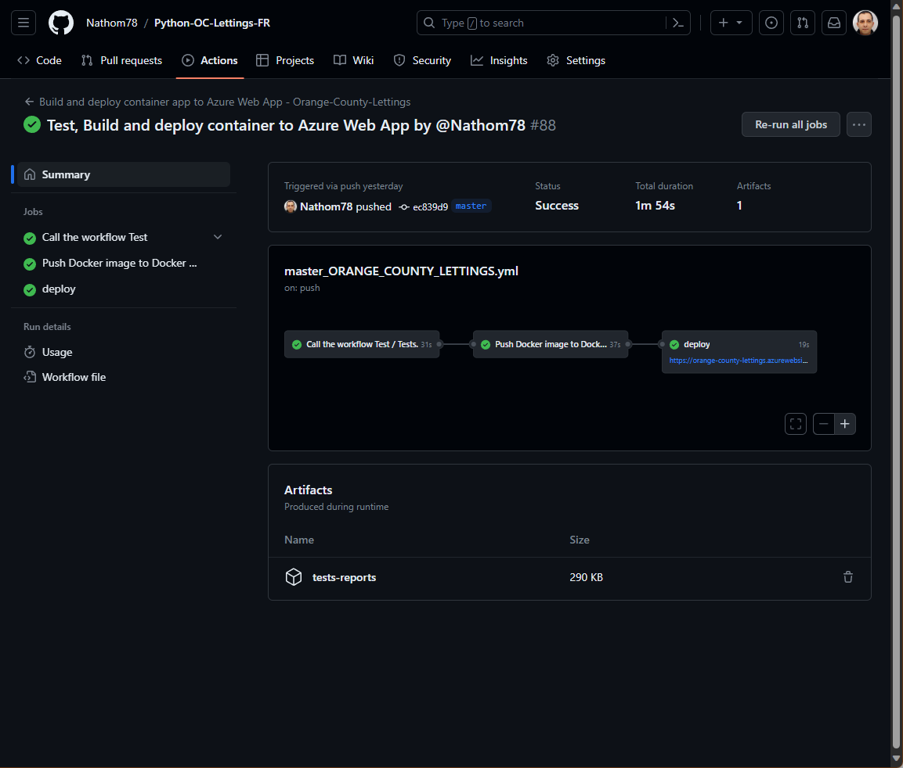

Déploiement et tests
====================

.. contents::
   :depth: 4
   :local:

Le pipeline CI/CD est orchestré à l'aide de workflows, sous GitHub action, afin d'assuré l'intégration et la distribution en continue.

Tout nouveau commit, sous la branche master, déclenche l'automatisation qui est composé :

- Le linting est testé.
- Si les tests unitaires sont satisfaisant et ont une couverture d'un minimum de 80% sur la totalité du code.
- Alors une image du site est construite et poussé vers le registre des conteneurs du Docker Hub.
- Puis si la conteneurisation est réussis alors l'image du conteneur est déployé et mis en production sur Microsoft Azure.

*Workflow*
----------

`Lien GithHub Actions <https://github.com/Nathom78/Python-OC-Lettings-FR/actions>`_

Il y a trois workflows sous GitHub :

- *'master_ORANGE_COUNTY_LETTINGS.yml'* se déclenche lors d'un nouveau "push" sous la branche 'master', utilisé pour le pipeline CI/CD.
- *'tests.yml'* un workflow réutilisable qui réalise tous les tests lorsqu'il est appelé, et créer les badges et rapports sous la branche badge.
- *'tests_for_others_branches.yml'* Lance les tests lors de 'push' sur toutes nouvelles branche.

Dans la mesure du possible nous utilisons un cache afin d'accélérer le workflow.

Exemple du pipeline CI/CD, sous GitHub :

.. role:: raw-html(raw)
    :format: html

:raw-html:` `

On y trouve sous *Artifacts* les rapports des tests, à télécharger.

:download:`Exemple <_static/tests-reports.zip>`.

*Tag de l'image*
----------------

Le nom de l'image Docker utilisé pour le déploiement, est composé des tags suivant:
- 'master'
- 'latest'

Les plus utilisé, mais Azure, ne réalise pas forcement le déploiement en production car le nom de l'image reste la même.
Un défault, même si le déploiement apparait bien dans la liste, mais n'est poussé en production.

Une autre méthode essayé était d'avoir un tag composé d'un @sha apposé par GitHub, afin qu'il soit different à chaque commit.
Mais le "répository" Docker Hub aurait eu multitude d'image, et obligé d'effacer le dernier. Un travail en plus.
Pour contourner cela, lors du pipeline CI/CD à la fin, en ajoutant un redémarrage de la web application permet de forcer la mise en production immédiate de l'image déployé.
Cela ne fait pas perdre de temps ou négligeable, sur le temps mis par le workflow afin d'avoir le déploiement realisé.

Il existe une amélioration, afin de rendre plus propre l'opération.

*Tests*
-------

Les tests, sont prévu pour garantir une uniformisation du code et une maintenabilité, même en équipe.
Même lors de commit sur une branche autre que *'master'*, les tests seront lancé.

Pour cela il suffit de garder l'organisation mise en place.

Il faut au minimum:
          - avoir le fichier *'setup.cfg'* à la racine,
          - avoir le fichier *'requirements.txt'* à la racine, avec en plus les outils de test,
          - avoir le repertoire *'reports'* à la racine, avec pour l'instant le fichier *'requirements.txt'*, ( voir : `badges`_ )
          - et dans chaque repertoires des applications Django, comme *'profiles'*, *'lettings'*, un fichier *'test.py'*,
          - enfin un fichier README avec les différents badges, le symbole pratique de la réussite des tests, et facilite l'accès aux rapports.

.. note::

          D'avoir le repertoire *'reports'* à la racine de la branche, permet grace au fichier *'requirements.txt'*,
          par lequel est installé une dépendance `genbadge <https://github.com/smarie/python-genbadge>`_, qui sera facile à changer.
          Sinon le workflow *'test.yml'* situé sous la branche *master* *'/.github/workflows/'*, pourra être changé,
          pour enlever cette obligation.

Linting
^^^^^^^

Flake8 est utilisé comme linter, qui respecte la PEP8.
La configuration est comme ceci :

voir `documentation officiel Flake8 <https://flake8.pycqa.org/en/latest/user/options.html#cmdoption-flake8-count>`_

setup.cfg

.. code-block:: python

                    [flake8]
                    max-line-length = 99
                    exclude =
                     ... fichiers/repertoires exclus du linting
                    tee = True
                    output-file=reports/flake8/flake8stats.txt
                    format= html
                    statistics = True
                    htmldir = reports/flake8/
                    show_source = True

Tests unitaires
^^^^^^^^^^^^^^^

Les tests unitaires sont configuré avec pytest.

`Documentation officiel de pytest <https://docs.pytest.org/en/stable/contents.html>`_

setup.cfg

.. code-block:: python

                    [tool:pytest]
                    DJANGO_SETTINGS_MODULE = oc_lettings_site.settings
                    python_files = tests.py
                    addopts = -v --no-migrations

--no migration : `pytest-django <https://pytest-django.readthedocs.io/en/latest/database.html>`_

Couverture
^^^^^^^^^^

La couverture des tests unitaires est réalisé par coverage, qui utilise comme configuration :

.. code-block:: python

                    [coverage:run]
                    omit =
                              tests.py
                              settings.py
                    data_file = reports/coverage/.coverage

                    [coverage:report]
                    omit = tests.py
                    fail_under = 80

                    [coverage:html]
                    directory = reports/coverage/

                    [coverage:xml]
                    output = reports/coverage/coverage.xml

`Documentation officiel coverage <https://coverage.readthedocs.io/en/stable/config.html>`_

Pour le badge nous avons besoin au préalable d'un cov report fichier *'.coverage'*
Puis un fichier XML pour la réalisation du badge.
Enfin un fichier HTML pour l'affichage du rapport.

.. note::

          La commande *coverage report* permet d'afficher le rapport directement dans la console.
          Pour notre cas enregistrer dans le fichier log de GitHub actions. Mais n'est pas requis.

*Résultats*
-----------

Une branche *'badges'* à été crée afin de recueillir les résultats.
Les résultats sont catalogué par branche, d'où à été lancé les tests.
Les résultats comprennent un rapport HTML accompagné d'un badge.

Badges
^^^^^^

Ces badges sont les tampons, de l'état des tests, avec les rapports associés.
Ils sont crées lors d'un commits, grace à un workflow GitHub actions *'tests.yml'* réutilisable.
Ils sont accéssible sous la branche *'badges'*, dans le repertoire rapports de la branche testé.

.. note::
          Pour avoir un lien web depuis le repository GitHub, voici un exemple :

          https://github.com/Nathom78/Python-OC-Lettings-FR/blob/badges/master/reports/tests-badge.svg?raw=true

Rapports
^^^^^^^^

Ils sont accéssibles, en version HTML, en ouvrant le fichier *'index.html'* dans le repertoire associé.
Ou pour la branche *'master'*, via le fichier README.md et ainsi dans la documentation, section démarrage rapide (README).

| Le rapport des tests unitaires avec pytest, se situe dans le repertoire *'junit'*.
| Le rapport du linting avec flake8, se situe dans le repertoire *'flake8'*.
| Le rapport de la couverture des tests, se situe dans le repertoire *'coverage'*.

.. note::

          Pour avoir un lien web depuis le repository GitHub, voici un exemple :

          http://htmlpreview.github.io/?https://github.com/Nathom78/Python-OC-Lettings-FR/blob/badges/master/reports/junit/index.html